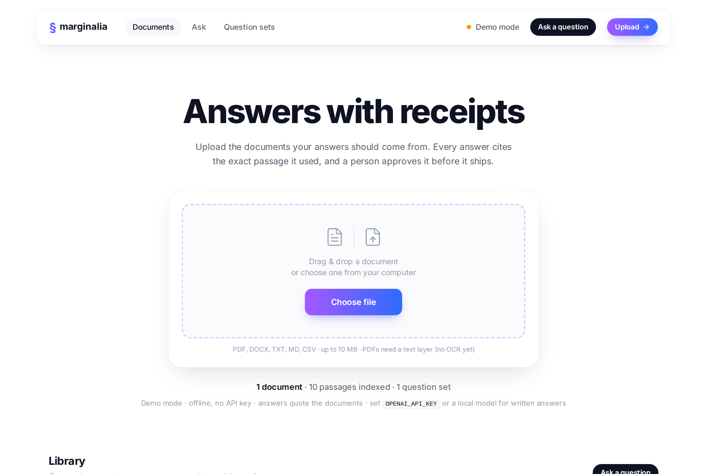
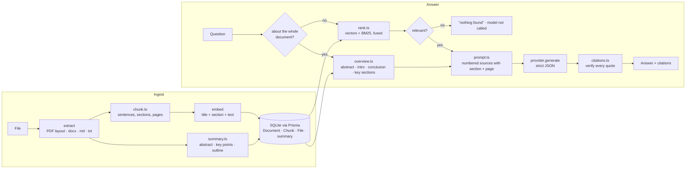
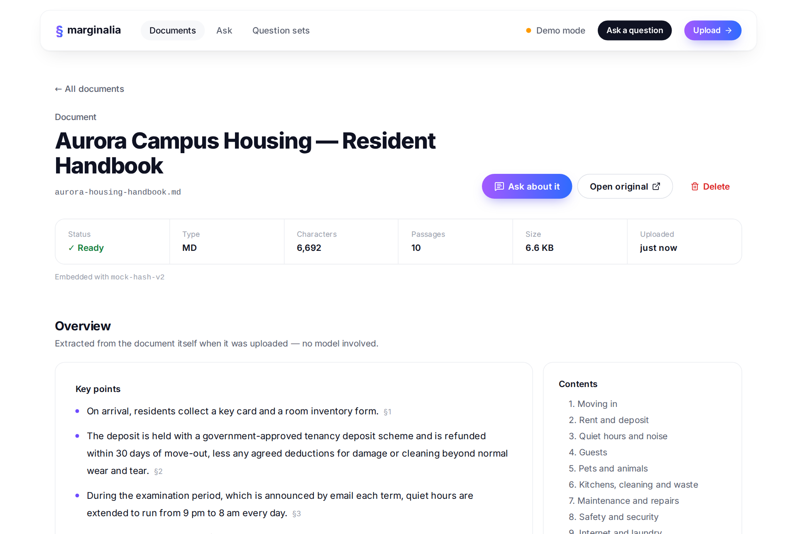
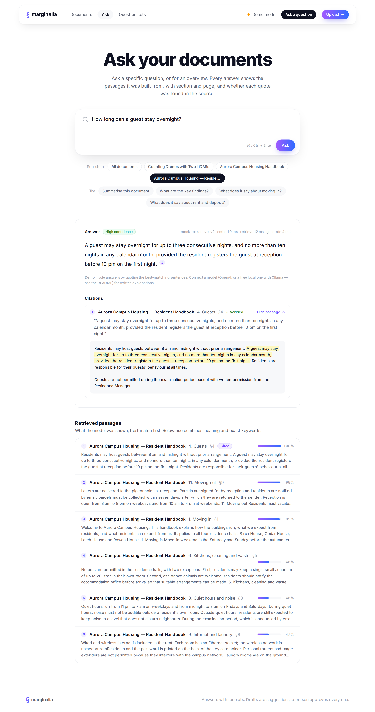
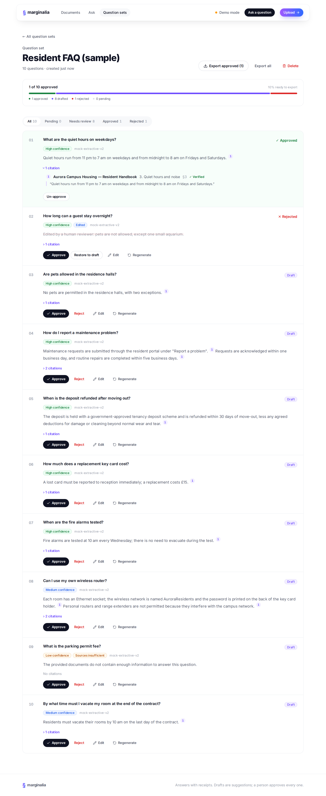
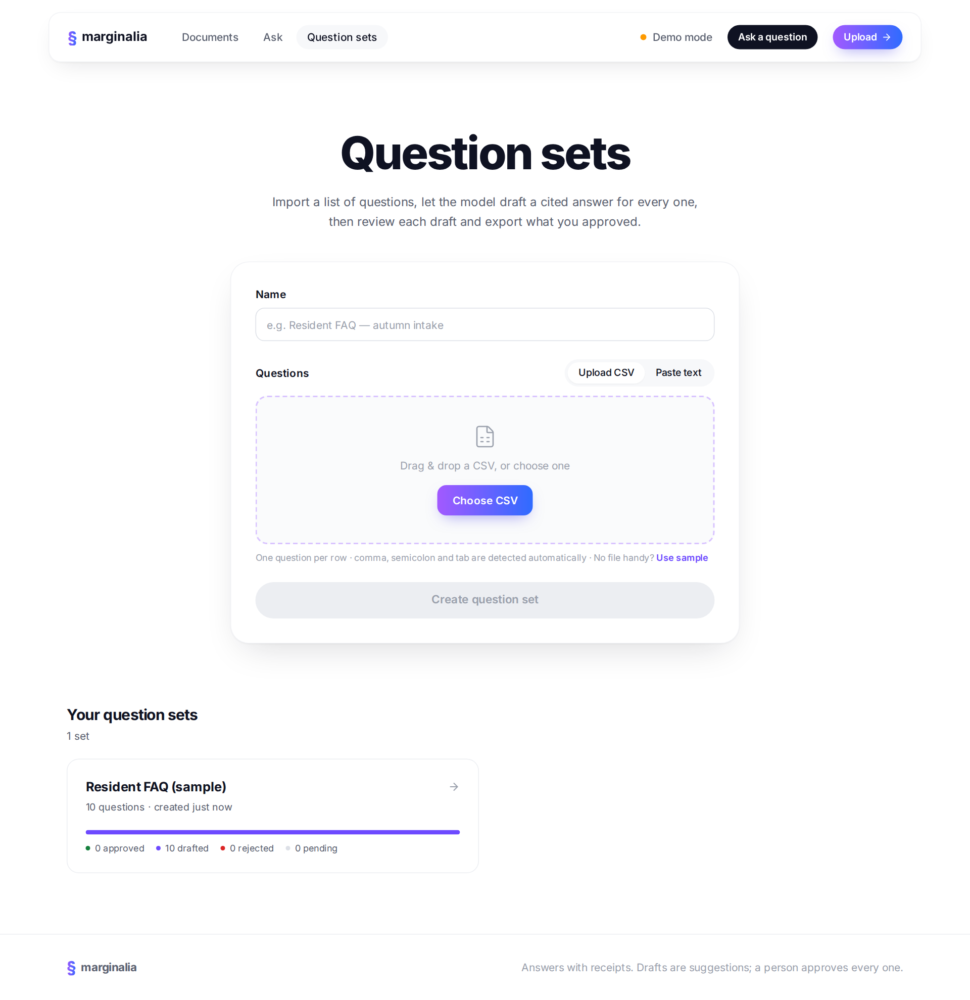
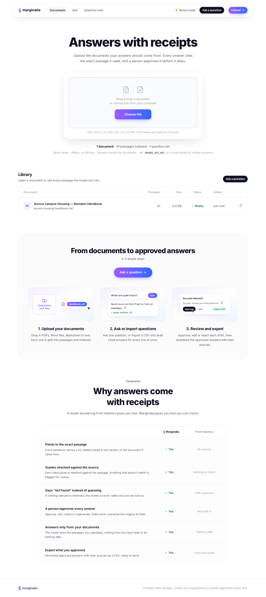
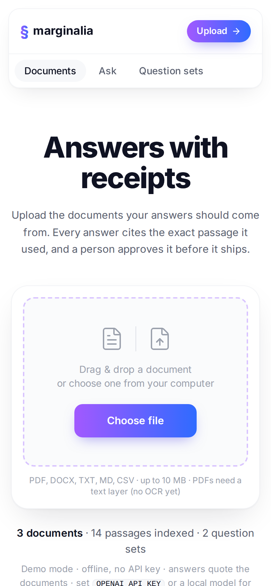

# Marginalia

**Grounded Q&A over your own documents — every answer cites the exact passage and page it came from, every quote is verified against the source, and a person approves each answer before it ships.**



Upload PDFs (including two-column research papers), Word files, Markdown or text. Each document gets an overview — abstract, key points, contents — the moment it is uploaded. Ask one-off questions or for a summary, or import a whole list of questions as a CSV, let the model draft cited answers for all of them, review each one (approve / edit / reject / regenerate), and export what you approved.

It runs fully offline in **demo mode** (a deterministic stand-in for a model, so `npm run seed` + `npm run dev` works with no key and costs nothing), and switches to **OpenAI** (`gpt-4o-mini` + `text-embedding-3-small`) — or any **OpenAI-compatible** model, including free local ones via Ollama — when you configure one.

## Quick start

```bash
git clone <this repo> marginalia && cd marginalia
npm install                 # also generates the Prisma client
cp .env.example .env        # leave OPENAI_API_KEY empty for demo mode
npm run db:push             # creates dev.db from prisma/schema.prisma
npm run seed                # sample handbook + 10-question set, answers drafted
npm run dev                 # http://localhost:3000
```

Requires Node 20.9+ (`.nvmrc` says 22).

**Upgrading from an earlier version?** Stop the app, run `npm install` and `npm run db:push` (new columns and a table for stored files), and start it again. Documents indexed by the old pipeline are marked _Outdated_: upload the same file again and it is re-processed in place (same id, same links); documents uploaded from now on can be re-processed with one click.

## Using a real model

Demo mode answers by _quoting_ the best-matching sentences; it cannot paraphrase, combine or explain. A real model can. Add to `.env` and restart:

| Option                                       | Settings                                                                                                                                                                                 |
| -------------------------------------------- | ---------------------------------------------------------------------------------------------------------------------------------------------------------------------------------------- |
| OpenAI                                       | `OPENAI_API_KEY=sk-…`                                                                                                                                                                    |
| Ollama (free, local)                         | `OPENAI_BASE_URL=http://localhost:11434/v1` `OPENAI_CHAT_MODEL=llama3.1` `OPENAI_EMBEDDING_MODEL=nomic-embed-text` (after `ollama pull` of both)                                         |
| Google Gemini                                | `OPENAI_BASE_URL=https://generativelanguage.googleapis.com/v1beta/openai/` `OPENAI_API_KEY=…` `OPENAI_CHAT_MODEL=<a current Gemini model>` `OPENAI_EMBEDDING_MODEL=gemini-embedding-001` |
| A chat-only service (no embeddings endpoint) | its `OPENAI_BASE_URL` + key + chat model, and `EMBEDDING_PROVIDER=local` (search stays offline; the model writes the answers)                                                            |

Servers that don't support OpenAI's strict JSON-schema mode are handled automatically: generation falls back to JSON mode, then to a plain prompt with the JSON extracted from the reply, and remembers what worked. Only the OpenAI path is exercised by the test suite against a fake client; check each provider's docs for current model names.

Changing the embedding model puts documents in a different vector space: they are flagged in the library with a **Re-process** button.

## What it does

| Page              | What happens                                                                                                                                                                                                                                                                                                                                               |
| ----------------- | ---------------------------------------------------------------------------------------------------------------------------------------------------------------------------------------------------------------------------------------------------------------------------------------------------------------------------------------------------------- |
| **Documents**     | Drag-and-drop upload → layout-aware extraction → section-aware chunking → embedding → SQLite. Duplicate files are detected by SHA-256. Failed extractions (e.g. a scanned PDF with no text layer) leave a visible `FAILED` row with the reason.                                                                                                            |
| **Document**      | An overview computed at upload without any model: the abstract, the most representative sentences as key points (each linked to its passage and page), and the contents with page numbers. Below it, every passage the model can cite, labelled with its section and a link that opens the original PDF at that page.                                      |
| **Ask**           | A specific question → hybrid search (meaning + exact keywords) → top-8 passages → structured-output answer with `[n]` markers → each quoted snippet checked against its source. Questions about a document as a whole ("summarise this", "explain the crucial details") are answered from its abstract, introduction, conclusion and key sections instead. |
| **Question sets** | Import a CSV (column auto-detected, previewed in the browser), draft answers for every row in small batches with a progress bar, then review: approve, edit (the AI draft is kept alongside your edit), reject, regenerate. Export approved answers as CSV, with page numbers.                                                                             |

## How it works



### Reading documents properly

Most of the quality of a document Q&A tool is decided before any model is involved: by how the text is read and cut. Flat text extraction from a PDF interleaves the two columns of a paper line by line, keeps every printed line break, splits words at hyphens ("cali- bration"), and mixes in running headers, page numbers and the tick labels of every chart. Fixed-size chunks then cut that through the middle of sentences. `src/lib/text/pdf-layout.ts` reads the page geometry instead:

- **Columns** are found from where text runs start and end on each page, and read left column first; full-width elements (title, wide tables) split the page into bands.
- **Lines become paragraphs, headings, captions and tables** using font size, font, spacing, indentation and numbering ("III. SYSTEM OVERVIEW", "C. Sensor Calibration", "2.1 Data").
- **Clean-up:** de-hyphenation that keeps real compounds ("solid-state"), ligatures and accents fixed, running headers/footers and page numbers removed, figure tick labels and stray fragments dropped, a sentence that continues into the next column re-joined, reference entries kept one per block, table rows labelled with their column headers ("Livox Avia — Range: 450 m; Freq.: 100 Hz").

`src/lib/rag/chunk.ts` then cuts only between whole sentences, starts a new chunk at each section, overlaps neighbouring chunks by one sentence, and records each chunk's section path and pages. Chunks are embedded _with_ the document title and section path, so a passage that never names its topic is still found by it.

### Finding the right passages

- **Hybrid search.** Embeddings capture meaning ("how much does it cost" ≈ "the fee is"); BM25 keyword scoring catches exact tokens embeddings blur (model numbers like "Mid-360", acronyms, names, figures). The two rankings are fused with reciprocal rank fusion. Reference lists are down-weighted unless the question is about references.
- **Overview questions** ("what is this about?", "key findings", "explain the crucial details") have no topic words to search for, so they are routed to the document's own summary material instead of similarity search.
- **Citations are verified, not trusted.** Every quote is checked against the passage it claims to come from; unverified quotes are flagged for the reviewer. Each citation shows its section and page and opens the original PDF at that page.
- **The model is skipped when nothing relevant is found.** Cheaper, and an honest "nothing found" instead of a hallucination.

The rest of the design — the provider seam that makes everything testable offline, strict JSON output, vectors as raw Float32 bytes in SQLite, human edits never overwriting the AI draft — is discussed in [`NOTES.md`](NOTES.md).

## Evaluation

`npm run eval` ingests a set of documents into a throw-away database and scores retrieval (does an evidence phrase appear in the top 1 / 3 / all passages shown to the model?) and answers (does the answer contain an expected phrase, or correctly say "not found"?). `npm run eval -- path/to/set.json --verbose` runs your own set and prints every answer.

Offline (demo-mode) results, before → after the structure-aware pipeline:

| Set                                                              | hit@1     | hit@3       | hit@k       | answer    |
| ---------------------------------------------------------------- | --------- | ----------- | ----------- | --------- |
| `eval/handbook.json` — sample handbook, 19 questions             | 83% → 94% | 100% → 100% | 100% → 100% | 79% → 95% |
| A 7-page two-column research paper, 20 questions (not committed) | 35% → 55% | 60% → 75%   | 85% → 95%   | 30% → 65% |

The remaining misses on the paper are mostly vocabulary gaps a lexical stand-in cannot bridge ("drones" vs "UAVs", "how long" vs "span 16 m") — exactly what real embeddings and a real model fix.

## Project layout

```
prisma/
  schema.prisma            data model (Document, DocumentFile, Chunk, QuestionSet, Question, Answer, Citation)
  migrations/              checked-in SQL; tests apply these directly
  seed-data/               sample handbook (original text) + sample questions
scripts/
  seed.ts                  loads the samples through the real ingestion path
  eval.ts                  retrieval + answer evaluation
eval/handbook.json         golden question set
src/
  app/                     Next.js 15 App Router
    page.tsx               documents dashboard (server component)
    ask/                   ad-hoc questions and overviews
    question-sets/         list, import form, review workbench
    documents/[id]/        overview + every indexed passage
    api/                   route handlers (see API below)
  components/              UI; client components are marked "use client"
  lib/
    ai/                    provider interface; OpenAI(-compatible) + offline implementations
    text/                  pdf-layout · structure (md/docx/txt/csv) · sentences · tokenize · salience
    rag/                   chunk · rank · bm25 · overview · summary · prompt · citations · answer · retrieve · ingest
    extract.ts             file → structured blocks
    locate.ts              page labels and "open at page" links
    csv.ts · drafting.ts · dto.ts · env.ts · errors.ts · http.ts
tests/                     Vitest: unit tests, a generated two-column PDF, and an end-to-end run through the route handlers
```

## API

All responses are JSON. Errors always look like `{ "error": { "code", "message", "details"? } }`.

| Method           | Path                                                | Purpose                                                                                                                 |
| ---------------- | --------------------------------------------------- | ----------------------------------------------------------------------------------------------------------------------- |
| `GET`            | `/api/health`                                       | provider + counts                                                                                                       |
| `GET` / `POST`   | `/api/documents`                                    | list / upload (`multipart/form-data`, field `file`); re-uploading an outdated document re-processes it (200)            |
| `GET` / `DELETE` | `/api/documents/:id`                                | detail with summary and passages / delete (cascades)                                                                    |
| `GET`            | `/api/documents/:id/file`                           | the original file (PDFs inline, so `#page=N` links work)                                                                |
| `POST`           | `/api/documents/:id/reprocess`                      | run the current pipeline and embedding model over the stored file                                                       |
| `POST`           | `/api/ask`                                          | `{ question, documentIds? }` → answer, mode (`answer` / `overview`), citations with pages, sources with scores, timings |
| `GET` / `POST`   | `/api/question-sets`                                | list / create from `{ name, csv, column?, hasHeader? }`                                                                 |
| `GET` / `DELETE` | `/api/question-sets/:id`                            | full set with answers / delete                                                                                          |
| `POST`           | `/api/question-sets/:id/draft`                      | draft the next `limit` (default 5) unanswered questions                                                                 |
| `GET`            | `/api/question-sets/:id/export?scope=approved\|all` | CSV download                                                                                                            |
| `POST`           | `/api/questions/:id/draft`                          | (re)generate one answer (409 if approved)                                                                               |
| `PATCH`          | `/api/answers/:id`                                  | `{ status?, finalText? }` — the review step                                                                             |

## Development

```bash
npm run check        # lint + typecheck + tests (what CI runs)
npm test             # vitest — 183 tests, a few seconds, no network, no external DB
npm run eval         # retrieval + answer quality on the golden set
npm run build        # production build
npm run db:studio    # browse the database
npm run format       # prettier
```

Tests get a fresh SQLite database per file, built from the checked-in migrations in a few milliseconds, so they run in parallel and never touch `dev.db`. The suite covers PDF layout reading against a generated IEEE-style two-column paper (`tests/fixtures/make-two-column-pdf.py`), structure detection for the other formats, sentence splitting, chunking, hybrid ranking, overview routing, summaries, citation verification, the offline model, the OpenAI provider against a fake client (parsing, retries, JSON-mode fallbacks, error mapping), database cascades, and one end-to-end pass through every API route: upload → overview → ask → import → draft → review → export → re-process → upgrade → delete.

## Environment

| Variable                 | Default                  | Notes                                                                       |
| ------------------------ | ------------------------ | --------------------------------------------------------------------------- |
| `DATABASE_URL`           | `file:./dev.db`          | SQLite path, relative to the project root (this default applies when unset) |
| `OPENAI_API_KEY`         | _(empty)_                | empty and no base URL ⇒ demo mode                                           |
| `OPENAI_BASE_URL`        | _(OpenAI)_               | any OpenAI-compatible server, e.g. `http://localhost:11434/v1`              |
| `AI_PROVIDER`            | auto                     | force `openai` or `mock`                                                    |
| `OPENAI_CHAT_MODEL`      | `gpt-4o-mini`            |                                                                             |
| `OPENAI_EMBEDDING_MODEL` | `text-embedding-3-small` |                                                                             |
| `EMBEDDING_PROVIDER`     | same as the provider     | `local` keeps search offline while a real model writes answers              |
| `MAX_UPLOAD_MB`          | `10`                     |                                                                             |

## Screenshots

| Document overview                                 | Ask                              |
| ------------------------------------------------- | -------------------------------- |
|  |  |

| Review workbench                                 | Question sets                                        |
| ------------------------------------------------ | ---------------------------------------------------- |
|  |  |

| Landing page (full)                             | Mobile                                      |
| ----------------------------------------------- | ------------------------------------------- |
|  |  |

## Status and limits

This is a single-user tool: there is no authentication, uploads are processed inside the request (fine up to a few MB), and vector search is a linear scan. Scanned PDFs need OCR, which is not built in. Charts and images are not read — only their captions. [`NOTES.md`](NOTES.md) lists what I would change first with more time, and why.
